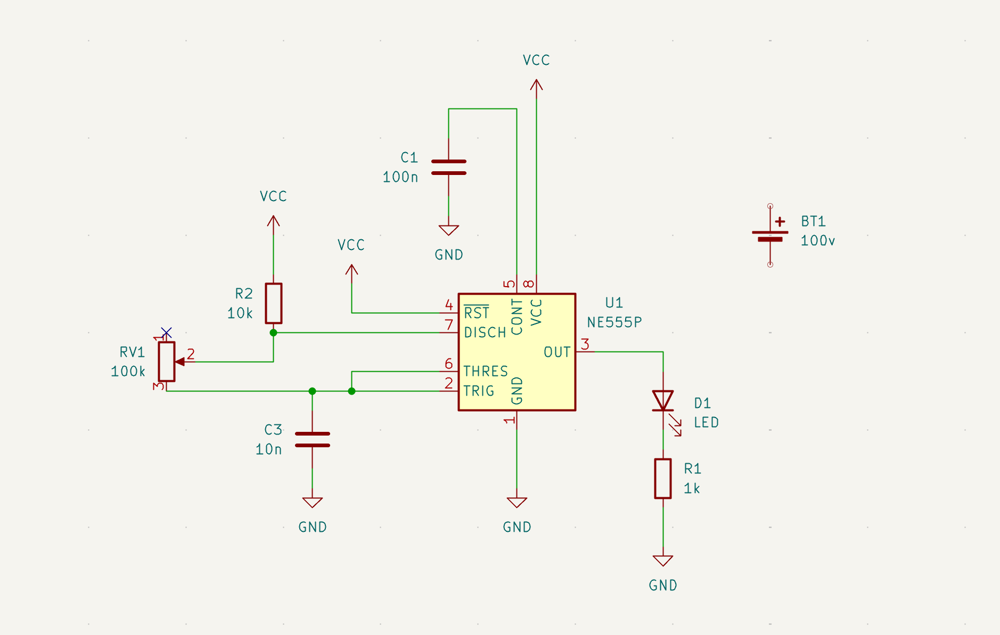
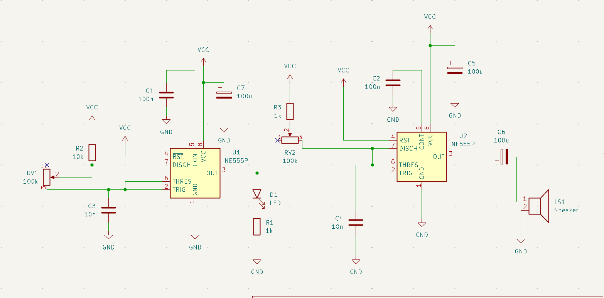
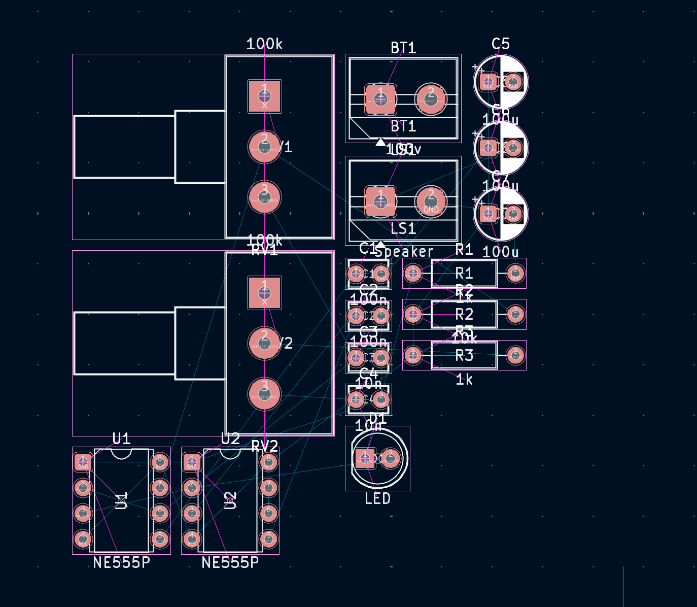
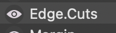

# sesion-08a

## Apuntes en clase

### KiCad

+ 1- Dibujar esquemático (.kicad_sch) 

+ 2- Asociar huellas a símbolos 

+ 3- Abrir PCB New (para crear PCB), interprete del esquemático 

+ 4- Definir tamaño de las pistas 

+ 5- Repartir componentes físicamente 

+ 6- rutear componentes 

+ 7- Ornamentar y exportar fabricación 

 + Quizás tenga que crear / descargar mis propias huellas y símbolos 

### Comandos

+ M: mover

+ C+D : duplicar 

+ esc: mouse 

+ G: mover componente seleccionado 

+ R: rotar 

+ X: reflejar 

+ W: modo cable 

### Para no olvidar : 

+ Potenciómetro : R_pot

+ X: marca de no conexión 

+ Batería: Battery_cell

+ Pitch : separación entre pines

+ n: medida común condensador no polarizado

+ u: medida común condesador polarizado

### Huellas

Doble click: huella > librería > buscar

Asignar huellas: copiar y pegar en los mismos componentes.

+ Resistor_THT:R_Axial_DIN0207_L6.3mm_D2.5mm_P10.16mm_Horizontal

+ Potentiometer_THT:Potentiometer_Alps_RK163_Single_Horizontal

+ LED_THT:LED_D5.0mm

+ Capacitor_THT:CP_Radial_D5.0mm_P2.50mm

En la clase le tome captura a Edge cuts porque lo considere importante quería anotarlo pero no lo recuerdo, lo dejaré acá como recordatorio. 

### Resultado final : 

https://github.com/user-attachments/assets/f1dd1bde-e54a-4e05-9cd8-cc6ac001694b

La clase se me hizo súper divertida y me gustó mucho aprender a usar KiCad. Ya quiero seguir aprendiendo más cosas; por mientras seguiré practicando lo que nos enseñaron, pero en serio se me hace muy entretenido. Estoy muy emocionada por esta nueva unidad y por ver los resultados que vamos a obtener más adelante.

